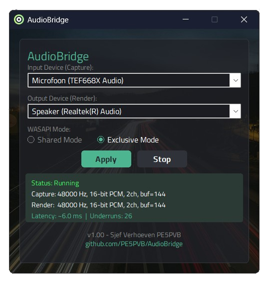

# AudioBridge

A lightweight Windows audio router that streams audio from one sound card's input to another's output using WASAPI, supporting both Shared and Exclusive modes with minimal latency.

## Features

- **Direct WASAPI audio routing** between any two sound cards
- **Shared Mode** — compatible with other applications using the same device
- **Exclusive Mode** — bypasses Windows audio engine for lowest possible latency
- **Automatic format matching** — render device tries capture format first to avoid resampling
- **Built-in resampler** — Media Foundation Resampler DSP for when devices use different formats
- **Pre-buffering** — eliminates initial underruns by filling the buffer before playback starts
- **Settings persistence** — remembers your device selection and mode between sessions
- **Auto-resume** — automatically restarts routing if the application was closed while active
- **Zero dependencies** — single portable .exe, no runtime installation required

## Screenshot

!\

## Use Cases

- Route audio from an **Headless TEF** to a output of a soundcard
- Bridge audio between **different sound cards** without Windows audio mixer
- Low-latency **audio monitoring** from a capture device to headphones on another device
- **Ham radio** digital mode setups (FT8, SSTV, etc.) requiring audio routing between interfaces

## Download

Download the latest release from the [Releases](https://github.com/PE5PVB/AudioBridge/releases) page.

## Building from Source

### Requirements

- Windows 10 or later
- Visual Studio 2025 (v18) with **Desktop development with C++** workload
- CMake 3.20+

### Build

```bash
cmake -G "Visual Studio 18 2026" -B build
cmake --build build --config Release
```

The compiled executable will be at `build/Release/AudioBridge.exe`.

## How It Works

```
Capture Device → WASAPI Capture → Ring Buffer → [Resampler] → Ring Buffer → WASAPI Render → Output Device
```

AudioBridge uses event-driven WASAPI with dedicated audio threads running at **Pro Audio** priority (MMCSS). A lock-free ring buffer connects the capture and render pipelines.

In **Exclusive Mode**, the render device first attempts to use the exact same format as the capture device. If the hardware doesn't support it, independent format negotiation kicks in and the built-in resampler handles the conversion transparently.

## Configuration

Settings are stored in `%APPDATA%\AudioBridge\settings.ini` and include:

| Setting | Description |
|---------|-------------|
| CaptureDevice | Selected input device |
| RenderDevice | Selected output device |
| ExclusiveMode | Shared (0) or Exclusive (1) mode |
| AutoStart | Resume routing on next launch |

## License
This program is free software; you can redistribute it and/or modify it under the terms of the GNU General Public License as published by the Free Software Foundation; either version 3 of the License, or (at your option) any later version.

This program is distributed in the hope that it will be useful, but WITHOUT ANY WARRANTY; without even the implied warranty of MERCHANTABILITY or FITNESS FOR A PARTICULAR PURPOSE. See the GNU General Public License for more details. 

## If you like this software
[](https://www.buymeacoffee.com/pe5pvb)
